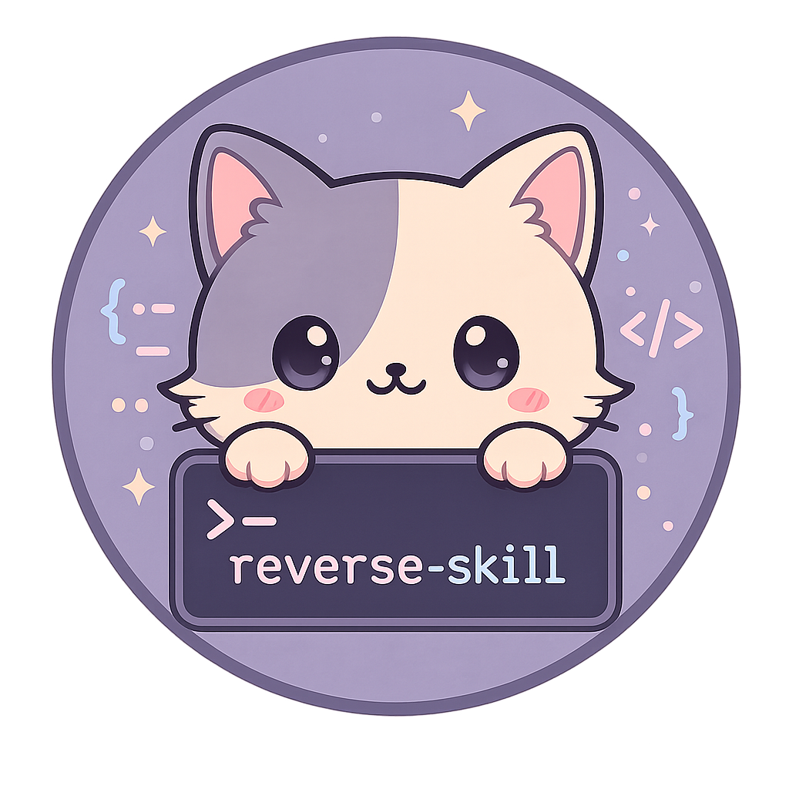

<p align="center">
  
</p>

<h1 align="center">reverse-skill</h1>
<h3 align="center">Cybersecurity Skills Router · 逆向技能路由包</h3>

<p align="center"><em style="font-family: Georgia, serif; font-size: 1.2em; color: #777;">Navigate the dark waters, sail against the stream.</em></p>

<p align="center">
  <a href="https://github.com/zhaoxuya520/reverse-skill/stargazers"></a>
  <a href="https://github.com/zhaoxuya520/reverse-skill/forks"></a>
  <a href="https://github.com/zhaoxuya520/reverse-skill/issues"></a>
  <a href="LICENSE"></a>
</p>

<p align="center">
  <a href="https://trendshift.io/repositories/43969?utm_source=trendshift-badge&amp;utm_medium=badge&amp;utm_campaign=badge-trendshift-43969" target="_blank" rel="noopener noreferrer"></a>
</p>

<br/>

<p align="center">
  <a href="#about">About</a> ·
  <a href="#getting-started">Getting Started</a> ·
  <a href="#usage">Usage</a> ·
  <a href="skills/routing.md">Routing</a> ·
  <a href="README_AI.md">AI Bootstrap</a> ·
  <a href="#contributing">Contributing</a>
</p>

<p align="center">
  🌐 <a href="README.md">中文</a>
</p>

<br/>

<a id="about"></a>

## About

> **If you are an AI Agent, jump to [README_AI.md](README_AI.md) and follow the instructions strictly.**

When an AI agent (Claude Code, Codex CLI, Cursor, etc.) encounters an APK, a binary, frontend JS encryption, a CTF challenge, or a pentesting target, this package routes it to the right methodology, checks available tools, and executes a repeatable workflow instead of guessing commands.

```
User task → RULES.md → Skill Router → Scenario Skill → Tools / MCP / Scripts → Report + field journal
```

**Why this exists:**
- AI agents don't know whether to use jadx, apktool, Frida, IDA, or BurpSuite for a given task
- APK, ELF, JS, PCAP, and CTF tasks each need different playbooks
- Tools, MCP servers, and scripts are scattered across machines
- The same mistakes get repeated because experience isn't reused

Full routing matrix: [skills/routing.md](skills/routing.md)

<br/>

<div align="center">
  <a href="https://star-history.com/#zhaoxuya520/reverse-skill&Date">
    
  </a>
</div>

<br/>

<p align="right">(<a href="#about">back to top</a>)</p>

### Built With

<p align="left">
  <br/>
  <code>IDA Pro</code> · <code>radare2</code> · <code>Ghidra</code>
</p>

<p align="right">(<a href="#about">back to top</a>)</p>

<a id="getting-started"></a>

## Getting Started

### Prerequisites

- **Java / JDK** — for jadx and apktool
- **Node.js 22.12+** — for JS toolchain and MCP servers
- **Python 3.x** — for Frida and helper scripts
- **A code AI client** — Claude Code, Codex CLI, Cursor, etc.

### Installation

```
git clone https://github.com/zhaoxuya520/reverse-skill.git
```

Then refresh the tool index per platform:

| Platform | Command |
|----------|---------|
| Windows | `powershell -File skills/scripts/refresh-tool-index.ps1` |
| Linux / macOS | `bash skills/scripts/refresh-tool-index.sh` |
| Kali Linux | `bash kali/scripts/refresh-tool-index.sh` |

Check [skills/tool-index.md](skills/tool-index.md) to see detected tools.

Platform-specific docs:
- **Kali Linux** → [kali/README-kali.md](kali/README-kali.md)
- **Ubuntu/Debian** → [docs/platforms/linux.md](docs/platforms/linux.md)
- **macOS** → [docs/platforms/macos.md](docs/platforms/macos.md)

<p align="right">(<a href="#getting-started">back to top</a>)</p>

<a id="usage"></a>

## Usage

### Supported scenarios

| Scenario | Entry |
|----------|-------|
| APK / Android analysis | `skills/apk-reverse/` |
| Binary reverse (exe/dll/so/elf) | `skills/ida-reverse/` / `skills/radare2/` |
| Frontend JS / encrypted params | `skills/js-reverse/` |
| HTTP capture / request replay | anything-analyzer + `js-reverse/` |
| Penetration testing / scanning | `skills/pentest-tools/` |
| CTF competition | `CTF-Sandbox-Orchestrator/` (40+ sub-skills) |
| Firmware / IoT | `skills/firmware-pentest/` |
| Patch diff / N-day | `skills/patch-diff-exploit/` |
| Pwn / exploit development | `skills/pwn-chain/` |
| EDR bypass | `skills/edr-bypass-re/` |
| LLM / AI security | `skills/llm-security/` |
| OLLVM deobfuscation | `skills/reverse-engineering/references/ollvm-deobfuscation.md` |
| Diagrams / reports | `skills/diagram-generator/` / `skills/docs-generator/` |

### Key files

| File | Purpose |
|------|---------|
| [README_AI.md](README_AI.md) | AI agent bootstrap and configuration |
| [RULES.md](RULES.md) | Global routing rules |
| [skills/routing.md](skills/routing.md) | Task → skill routing matrix |
| [skills/SKILL.md](skills/SKILL.md) | Master entry point |
| [skills/tool-index.md](skills/tool-index.md) | Local tool status (auto-generated) |

### Repository layout

```
.
├── README.md              # Chinese entry
├── README_EN.md           # This file — English entry
├── README_AI.md           # AI agent bootstrap
├── RULES.md               # Global routing rules
├── skills/
│   ├── SKILL.md           # Master entry
│   ├── routing.md         # Routing matrix
│   ├── field-journal/     # Experience logs
│   ├── apk-reverse/       # APK reverse
│   ├── js-reverse/        # JS reverse
│   ├── ida-reverse/       # IDA Pro workflow
│   ├── radare2/           # radare2
│   ├── reverse-engineering/ # General RE
│   ├── pentest-tools/     # Penetration testing
│   ├── pwn-chain/         # Exploit development
│   ├── patch-diff-exploit/ # N-day
│   ├── firmware-pentest/  # Firmware / IoT
│   ├── edr-bypass-re/     # EDR bypass
│   ├── binary-diff/       # Symbol migration
│   ├── browser-automation/ # Browser / desktop
│   ├── diagram-generator/ # Diagrams
│   ├── docs-generator/    # Reports
│   └── llm-security/      # LLM security
├── CTF-Sandbox-Orchestrator/ # CTF skills
├── docs/                     # Overview & architecture docs
└── kali/                     # Kali scripts
```

<p align="right">(<a href="#usage">back to top</a>)</p>

<a id="contributing"></a>

## Contributing

Contributions are welcome! Fork the repo, create a feature branch, and open a PR.

1. Fork the Project
2. `git checkout -b feature/AmazingFeature`
3. `git commit -m 'Add some AmazingFeature'`
4. `git push origin feature/AmazingFeature`
5. Open a Pull Request

### Contributors

<a href="https://github.com/zhaoxuya520/reverse-skill/graphs/contributors">
  
</a>

<p align="right">(<a href="#contributing">back to top</a>)</p>

<a id="license"></a>

## ⚖️ License

This project (`reverse-skill`) is primarily licensed under the **MIT License** (see [LICENSE](LICENSE)).

**Submodule and third-party dependencies:**
- **CTF-Sandbox-Orchestrator/**: **GNU GPLv3**
- **Pentest Swarm AI**: Original project is **AGPL-3.0**. This repo only invokes it via CLI or MCP and does not include its source code
- Other tools (jadx, frida, nmap, burpsuite-mcp, etc.) are subject to their respective official licenses

<p align="right">(<a href="#license">back to top</a>)</p>

<a id="acknowledgments"></a>

## Acknowledgments

Thanks to all open-source tool authors. This project integrates tools across reverse engineering, penetration testing, CTF, and security analysis — every tool is the fruit of community effort.

Special thanks to the OLLVM deobfuscation ecosystem contributors and everyone who submitted test samples, issues, and PRs.

<p align="right">(<a href="#acknowledgments">back to top</a>)</p>
