# Diagram Patterns

Use these compact patterns when generating diagram source. Prefer adapting the pattern instead of inventing complex syntax.

## Mermaid flowchart

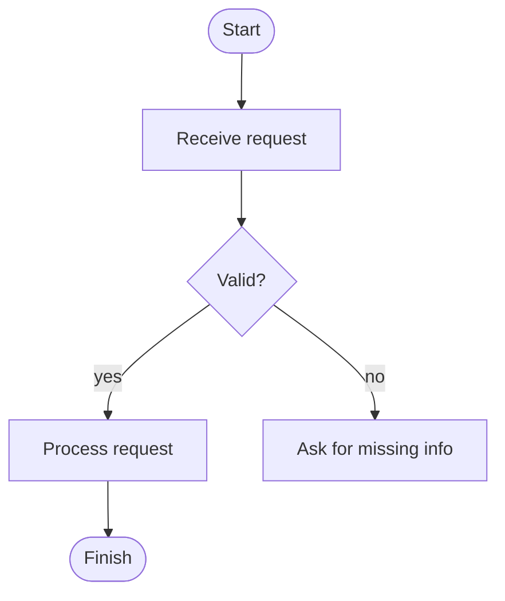

## Mermaid swimlane-style flowchart

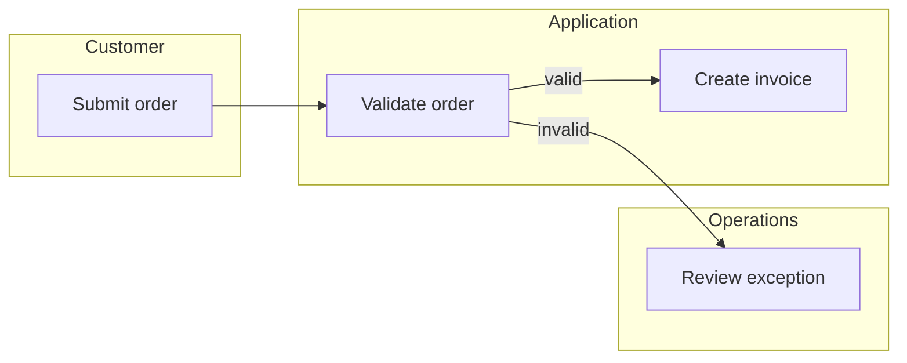

## Mermaid architecture

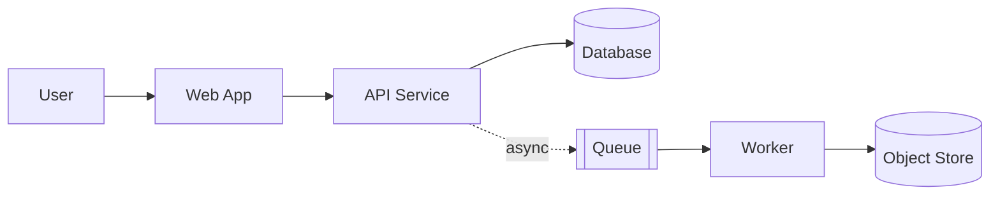

## Mermaid sequence diagram

```mermaid
sequenceDiagram
  actor User
  participant Web
  participant API
  database DB
  User->>Web: Submit request
  Web->>API: POST /request
  API->>DB: Save record
  DB-->>API: OK
  API-->>Web: 201 Created
  Web-->>User: Show confirmation
```

## Mermaid ER diagram

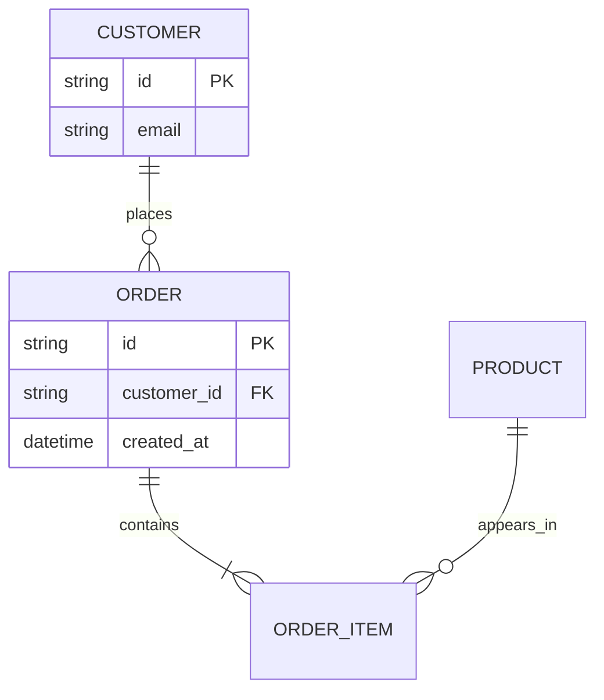

## Mermaid state diagram

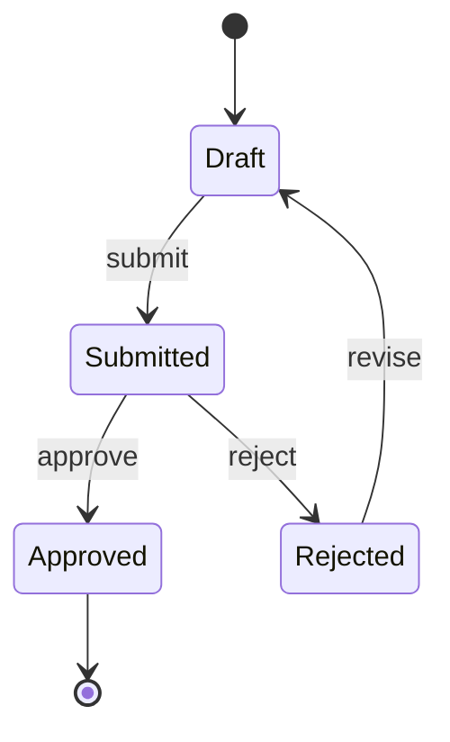

## Mermaid class diagram

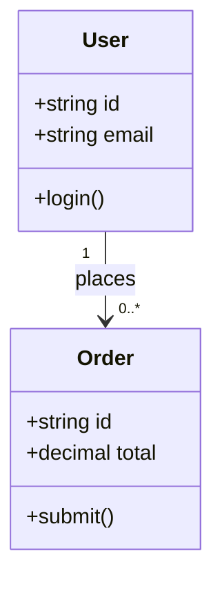

## Mermaid gantt

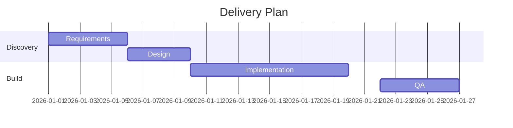

## Mermaid mindmap

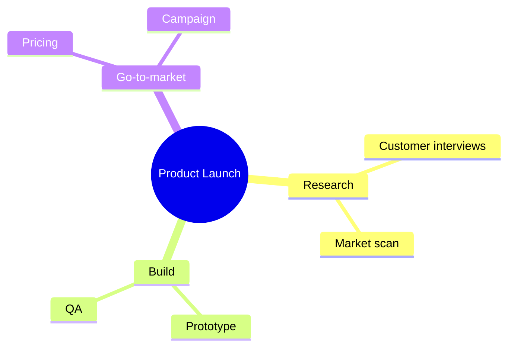

## Mermaid user journey

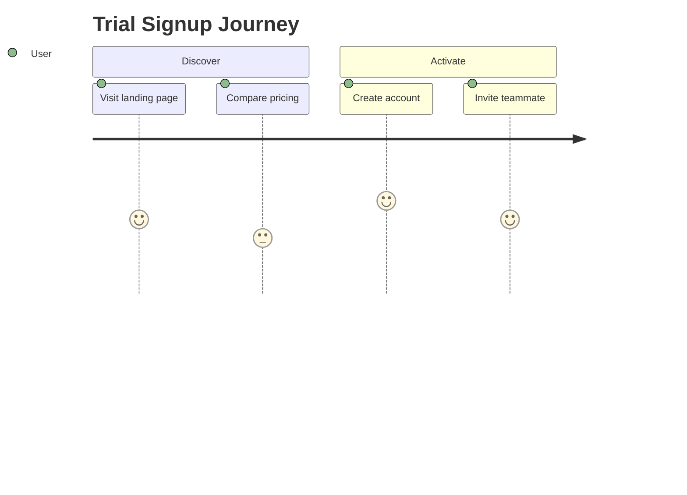

## Graphviz dependency graph

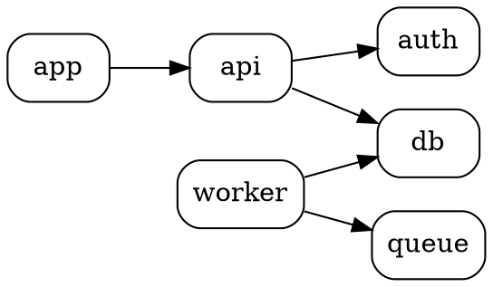

## Graphviz clustered architecture

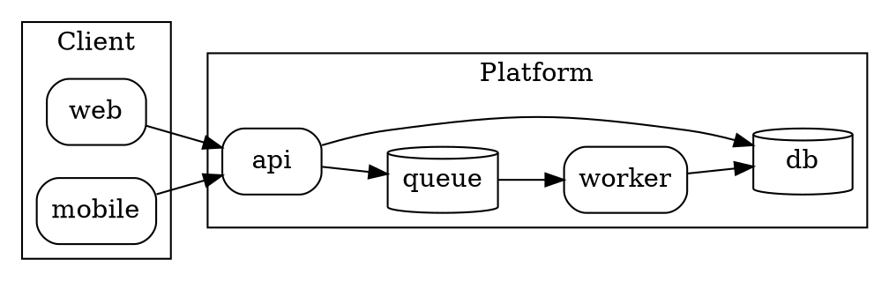

## PlantUML sequence

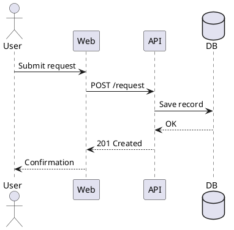

## PlantUML component architecture

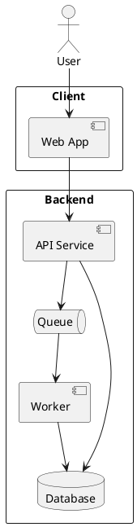

## SVG fallback

```svg
<svg xmlns="http://www.w3.org/2000/svg" width="900" height="360" viewBox="0 0 900 360" role="img">
  <title>Simple process diagram</title>
  <defs>
    <marker id="arrow" markerWidth="10" markerHeight="10" refX="8" refY="3" orient="auto">
      <path d="M0,0 L0,6 L9,3 z" />
    </marker>
  </defs>
  <rect x="40" y="120" width="160" height="70" rx="10" fill="white" stroke="black" />
  <text x="120" y="160" text-anchor="middle">Start</text>
  <line x1="200" y1="155" x2="320" y2="155" stroke="black" marker-end="url(#arrow)" />
  <rect x="320" y="120" width="180" height="70" rx="10" fill="white" stroke="black" />
  <text x="410" y="160" text-anchor="middle">Process</text>
</svg>
```
